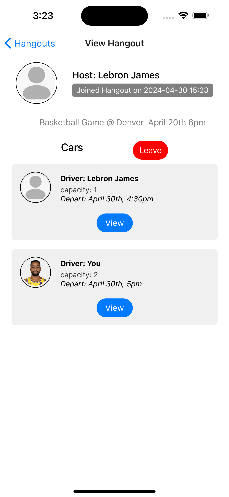

# Knits
Group #1: Fardin Haque, Norlando Gamez-Torres, Daniel Ung. Social media mobile app with an emphasis on efficiently organizing hangouts with friends. Main features include:
* Hangouts: Create or join hangouts that your friends make. Add a description, date, time and create or join rides 
* Following: Follow other users and check out their profile, posts, and hangouts.
* Feed: View posts for the people you are following and see reccomended people based on who you are following
  
[Report](https://docs.google.com/document/d/1eIhGSUCmepIu24IrWza36HGMPlMtQqN2vQ54_IWFuCw/edit?usp=sharing)

## Prerequistes
The application is recommended to be ran on MacOS as it has only been tested for iOS.
* [React Native](https://reactnative.dev/docs/environment-setup?guide=native) used for running the frontend.
    * the above link includes instructions for downloading the the iOS simulator as well, please reference those steps until "Installing an iOS Simulator in Xcode" to set-up the required dependencies if not met already.
* [Xcode](https://apps.apple.com/us/app/xcode/id497799835?mt=12) used for the iOS simulator, ensure CLI tools are installed. Additional instructions to set it up can be referenced above.
* [Maven](https://maven.apache.org/download.cgi) used for running the Spring Boot backend.
* [MySQL](https://dev.mysql.com/downloads/mysql/) used for the database.

## Set Up
### Cloning the repository
In your preferred directory run:
* Using SSH: `git clone git@github.com:FardinHaque60/Knits.git && cd Knits`
* Using HTTPS: `git clone https://github.com/FardinHaque60/Knits.git && cd Knits`

You are now in the Knits root project directory

### Setting up the database
* Open a terminal and enter mysql: `mysql -u root -p`
* Create the Knits DB: `create database Knits_DB;`
* Create the Knits user: `create user 'Knits'@'localhost' identified by 'Knits';`
* Grant priviledges for the Knits user to the DB: `grant all on Knits_DB.* to 'Knits'@'localhost';`
* OPTIONAL ~ Open a new terminal and ensure you are in the Knits project direcotry. Prepopulate your database: `mysql -u Knits -p Knits_DB < Knits_Sample_DB.sql`
    * This provides some pre-made users and following relaitonships in the application so you can play around with the features without having to put in some boilerplate.

### Running the backend
* navigate to the backend folder: `cd backend`
* run the backend: `mvn spring-boot:run`

### Running the frontend
* navigate to the frontend directory in Knits: `cd frontend`
* install all needed node packages: `npm install`
* start the frontend: `npx expo start`
    * it will give an option to select which device to run it on, we recommend typing `i` to run on iOS and select iPhone 15 Pro Max in simulator

## Database Schema

## Views
### Login + Create Account 
 

### Feed

### Hangouts
   

### Profile
 
